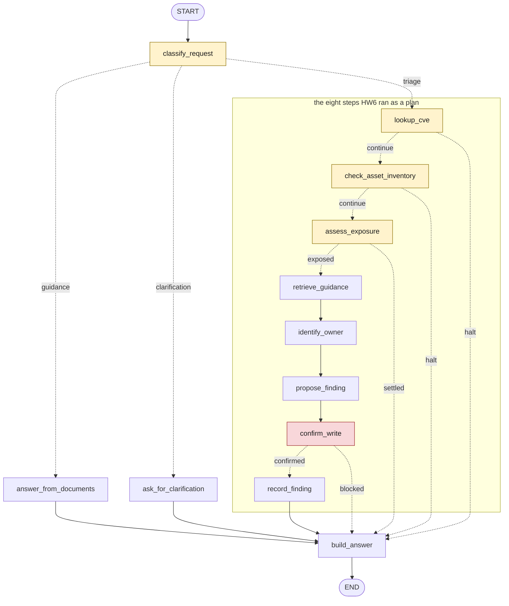

# LangGraph workflow — traced examples

Generated: 2026-08-22 13:51:36Z
Framework: `langgraph 1.2.11` · Model: `gpt-4.1-mini` · Router: `agent_router`

> This product uses the NVD API but is not endorsed or certified by
> the NVD.

Regenerate with `uv run python scripts/run_langgraph_examples.py`.
The prose is written by hand in `configs/langgraph_scenarios.yaml`
and `configs/langgraph_conclusions.md`; the diagram, every route,
node, call, observation, state and answer below is produced by
running the graph.

## The graph

Drawn from the compiled graph, so it is the workflow that ran and
not a picture kept beside it. A dotted edge was chosen by a
function; a coloured node is one such a function reads.



## Examples

### 1. Does CVE-2025-68664 affect us?

The whole graph, and the only run that reaches every node it can.

Ten of twelve nodes execute. The two that do not are the other two
branches out of `classify_request`, which is what a conditional edge
is for: the route was decided once, at the first node, and eight
nodes downstream ran because of that decision rather than because
anyone listed them.

Compare the trace against HW6's. The eight steps in the middle are
the same eight, in the same order, with the same calls. What the
graph added is a node at each end.

**Question:** Does CVE-2025-68664 affect us?

**Route:** `triage` — The goal names a CVE, so exposure can be checked.

**Confirmed by a human:** True

**Nodes run:** 10 of 12 in the graph

| # | Node | Wrote to state | Tool called | Observation | Note |
|---|---|---|---|---|---|
| 1 | `classify_request` | `clarification_question`, `cve_id`, `route`, `route_reason` | — | — | Sent to triage: The goal names a CVE, so exposure can be checked. |
| 2 | `lookup_cve` | `cve_record` | `lookup_cve` `{"cve_id": "CVE-2025-68664"}` | ok, cached · Analyzed, CVSS 8.2 | CVE-2025-68664 is Analyzed. |
| 3 | `check_asset_inventory` | `affected_services` | `check_asset_inventory` `{"cve_id": "CVE-2025-68664"}` | ok · svc-chat-gateway, svc-doc-indexer | Services running the component: 2. |
| 4 | `assess_exposure` | `exposure` | — | — | svc-chat-gateway runs langchain-core 0.3.74, fixed in 0.3.81. |
| 5 | `retrieve_guidance` | `guidance` | — | — | answered, 2 citations. |
| 6 | `identify_owner` | `owner` | `get_service_owner` `{"service_id": "svc-chat-gateway"}` | ok · Conversational AI | Notify Conversational AI. |
| 7 | `propose_finding` | `proposed_finding` | — | — | Severity high. |
| 8 | `confirm_write` | `write_authorized` | — | — | Confirmed by the caller. |
| 9 | `record_finding` | `recorded_finding` | `record_security_finding` `{"related_cve_id": "CVE-2025-68664", "severity": "high",…` | ok · find_8e2355c84267 | Stored as find_8e2355c84267. |
| 10 | `build_answer` | `final_answer` | — | — | Answer for the triage route. |

**Finding drafted:**

```json
{
  "title": "CVE-2025-68664 affects svc-chat-gateway",
  "severity": "high",
  "related_cve_id": "CVE-2025-68664",
  "summary": "svc-chat-gateway runs langchain-core 0.3.74, fixed in 0.3.81"
}
```

**Final state:**

```json
{
  "route": "triage",
  "cve_id": "CVE-2025-68664",
  "exposure": "exposed",
  "affected_services": [
    "svc-chat-gateway",
    "svc-doc-indexer"
  ],
  "owner": "Conversational AI",
  "pending_confirmation": false,
  "write_authorized": true,
  "recorded_finding": "find_8e2355c84267",
  "halt_reason": null,
  "executed_nodes": [
    "classify_request",
    "lookup_cve",
    "check_asset_inventory",
    "assess_exposure",
    "retrieve_guidance",
    "identify_owner",
    "propose_finding",
    "confirm_write",
    "record_finding",
    "build_answer"
  ],
  "tool_calls": [
    "lookup_cve",
    "check_asset_inventory",
    "get_service_owner",
    "record_security_finding"
  ]
}
```

**Final answer:**

```text
CVE-2025-68664 is Analyzed, CVSS 8.2 HIGH per nvd@nist.gov, retrieved 2026-08-11.
Exposed: svc-chat-gateway runs langchain-core 0.3.74, fixed in 0.3.81.
Owner: Conversational AI, #sec-conversational-ai.
OWASP guidance: An AI agent should treat all external data as untrusted, including user messages, retrieved documents, API responses, and emails, and implement input sanitization before including such content in the agent's context. It is important to use delimiters and clear boundaries between instructions and data, apply content filtering for known injection patterns, and consider using separate LLM calls to validate or summarize untrusted content. Architecturally, the dual-LLM pattern can limit damage by having a privileged LLM that holds tools but never reads untrusted content directly, while a quarantined LLM reads untrusted content but cannot take action; the privileged model only receives structured summaries or labels, breaking the path for injected instructions to influence the actor. This approach helps refuse actions that drift due to injected instructions, thus limiting the damage from hostile input [owasp_cs_ai_agent_security_chunk_009][owasp_cs_prompt_injection_prevention_chunk_036].
Finding recorded as find_8e2355c84267.
```

### 2. Does CVE-2025-68664 affect us?

The same goal, one flag different, and the node that reads it.

`confirm_write` runs and writes `write_authorized: false`. The edge
under it reads that field and goes to `build_answer` instead of
`record_finding`. Nothing reaches `data/findings.jsonl`.

The field exists because of a defect this port introduced. HW6's
`confirm_write` returned a boolean that `run_triage` had to read, so
a workflow that skipped the gate could not compile. A graph has no
such coupling: an edge reads a field, and a field a node never wrote
still holds its default. The first version of that edge read
`pending_confirmation`, whose default is `false` - and so a graph
with the gate removed would have written every time.

**Question:** Does CVE-2025-68664 affect us?

**Route:** `triage` — The goal names a CVE, so exposure can be checked.

**Confirmed by a human:** False

**Nodes run:** 9 of 12 in the graph

| # | Node | Wrote to state | Tool called | Observation | Note |
|---|---|---|---|---|---|
| 1 | `classify_request` | `clarification_question`, `cve_id`, `route`, `route_reason` | — | — | Sent to triage: The goal names a CVE, so exposure can be checked. |
| 2 | `lookup_cve` | `cve_record` | `lookup_cve` `{"cve_id": "CVE-2025-68664"}` | ok, cached · Analyzed, CVSS 8.2 | CVE-2025-68664 is Analyzed. |
| 3 | `check_asset_inventory` | `affected_services` | `check_asset_inventory` `{"cve_id": "CVE-2025-68664"}` | ok · svc-chat-gateway, svc-doc-indexer | Services running the component: 2. |
| 4 | `assess_exposure` | `exposure` | — | — | svc-chat-gateway runs langchain-core 0.3.74, fixed in 0.3.81. |
| 5 | `retrieve_guidance` | `guidance` | — | — | answered, 2 citations. |
| 6 | `identify_owner` | `owner` | `get_service_owner` `{"service_id": "svc-chat-gateway"}` | ok · Conversational AI | Notify Conversational AI. |
| 7 | `propose_finding` | `proposed_finding` | — | — | Severity high. |
| 8 | `confirm_write` | `pending_confirmation`, `write_authorized` | — | — | Not confirmed; nothing written. |
| 9 | `build_answer` | `final_answer` | — | — | Answer for the triage route. |

**Finding drafted:**

```json
{
  "title": "CVE-2025-68664 affects svc-chat-gateway",
  "severity": "high",
  "related_cve_id": "CVE-2025-68664",
  "summary": "svc-chat-gateway runs langchain-core 0.3.74, fixed in 0.3.81"
}
```

**Final state:**

```json
{
  "route": "triage",
  "cve_id": "CVE-2025-68664",
  "exposure": "exposed",
  "affected_services": [
    "svc-chat-gateway",
    "svc-doc-indexer"
  ],
  "owner": "Conversational AI",
  "pending_confirmation": true,
  "write_authorized": false,
  "recorded_finding": null,
  "halt_reason": null,
  "executed_nodes": [
    "classify_request",
    "lookup_cve",
    "check_asset_inventory",
    "assess_exposure",
    "retrieve_guidance",
    "identify_owner",
    "propose_finding",
    "confirm_write",
    "build_answer"
  ],
  "tool_calls": [
    "lookup_cve",
    "check_asset_inventory",
    "get_service_owner"
  ]
}
```

**Final answer:**

```text
CVE-2025-68664 is Analyzed, CVSS 8.2 HIGH per nvd@nist.gov, retrieved 2026-08-11.
Exposed: svc-chat-gateway runs langchain-core 0.3.74, fixed in 0.3.81.
Owner: Conversational AI, #sec-conversational-ai.
OWASP guidance: An AI agent should treat all external data as untrusted, including user messages, retrieved documents, API responses, and emails, and implement input sanitization before including such content in the agent's context. It is important to use delimiters and clear boundaries between instructions and data, apply content filtering for known injection patterns, and consider using separate LLM calls to validate or summarize untrusted content. Architecturally, the dual-LLM pattern can limit damage by having a privileged LLM that holds tools but never reads untrusted content directly, while a quarantined LLM reads untrusted content but cannot take action; the privileged model only receives structured summaries or labels, breaking the path for injected instructions to influence the actor. This approach helps refuse actions that drift due to injected instructions, thus limiting the damage from hostile input [owasp_cs_ai_agent_security_chunk_009][owasp_cs_prompt_injection_prevention_chunk_036].
A finding is drafted and waiting for confirmation. Nothing has been written.
```

### 3. Does CVE-2025-67644 affect us?

The run that stops early, and the edge that stops it.

One deployed service runs the affected component, and it is already
on the fixed version. `assess_exposure` concludes `patched`, and the
edge under it sends the run straight to `build_answer`.

Five nodes of twelve. The seven that did not run include
`retrieve_guidance`, the only node on this branch that spends a model
call. That is the practical shape of conditional routing: not a
tidier diagram, but a model call not made because the state already
settled the question.

**Question:** Does CVE-2025-67644 affect us?

**Route:** `triage` — The goal names a CVE, so exposure can be checked.

**Confirmed by a human:** False

**Nodes run:** 5 of 12 in the graph

| # | Node | Wrote to state | Tool called | Observation | Note |
|---|---|---|---|---|---|
| 1 | `classify_request` | `clarification_question`, `cve_id`, `route`, `route_reason` | — | — | Sent to triage: The goal names a CVE, so exposure can be checked. |
| 2 | `lookup_cve` | `cve_record` | `lookup_cve` `{"cve_id": "CVE-2025-67644"}` | ok, cached · Analyzed, CVSS 7.8 | CVE-2025-67644 is Analyzed. |
| 3 | `check_asset_inventory` | `affected_services` | `check_asset_inventory` `{"cve_id": "CVE-2025-67644"}` | ok · svc-agent-runtime | Services running the component: 1. |
| 4 | `assess_exposure` | `exposure` | — | — | Every affected service is already on the fix. |
| 5 | `build_answer` | `final_answer` | — | — | Answer for the triage route. |

**Final state:**

```json
{
  "route": "triage",
  "cve_id": "CVE-2025-67644",
  "exposure": "patched",
  "affected_services": [
    "svc-agent-runtime"
  ],
  "owner": null,
  "pending_confirmation": false,
  "write_authorized": null,
  "recorded_finding": null,
  "halt_reason": null,
  "executed_nodes": [
    "classify_request",
    "lookup_cve",
    "check_asset_inventory",
    "assess_exposure",
    "build_answer"
  ],
  "tool_calls": [
    "lookup_cve",
    "check_asset_inventory"
  ]
}
```

**Final answer:**

```text
CVE-2025-67644 is Analyzed, CVSS 7.8 HIGH per nvd@nist.gov, retrieved 2026-08-11.
Every service running the component is already on the fix.
```

### 4. Are we affected by that LangChain bug?

A route that runs no tool and asks nothing of the corpus.

Three nodes: classify, ask, answer. `classify_request` finds no
identifier and writes the question that `build_answer` returns.

Worth including because it is the cheapest run the graph can do, and
because its trace shows the two nodes HW6 had no name for. In HW6
this route completed "1 of 1" planned steps while the router and the
answer composer ran outside the count. Here everything that happened
is in the trace.

**Question:** Are we affected by that LangChain bug?

**Route:** `clarification` — The goal asks about this deployment but names no identifier, and the documents hold no deployment facts.

**Confirmed by a human:** False

**Nodes run:** 3 of 12 in the graph

| # | Node | Wrote to state | Tool called | Observation | Note |
|---|---|---|---|---|---|
| 1 | `classify_request` | `clarification_question`, `cve_id`, `route`, `route_reason` | — | — | Sent to clarification: The goal asks about this deployment but names no identifier, and the documents hold no deployment facts. |
| 2 | `ask_for_clarification` | — | — | — | Asked for a CVE identifier. |
| 3 | `build_answer` | `final_answer` | — | — | Answer for the clarification route. |

**Final state:**

```json
{
  "route": "clarification",
  "cve_id": null,
  "exposure": null,
  "affected_services": [],
  "owner": null,
  "pending_confirmation": false,
  "write_authorized": null,
  "recorded_finding": null,
  "halt_reason": null,
  "executed_nodes": [
    "classify_request",
    "ask_for_clarification",
    "build_answer"
  ],
  "tool_calls": []
}
```

**Final answer:**

```text
Which CVE do you mean? Checking whether something affects this organization needs an identifier, for example CVE-2025-68664.
```

## Every path, run

One row per outcome the graph can reach. Each was executed for this
report; none of it is written by hand.

| Goal | Confirmed | Route | Exposure | Nodes | Calls | Wrote |
|---|---|---|---|---|---|---|
| Does CVE-2025-68664 affect us? | True | `triage` | exposed | 10 of 12 | 4 | `find_8e2355c84267` |
| Does CVE-2025-68664 affect us? | False | `triage` | exposed | 9 of 12 | 3 | — |
| Does CVE-2025-67644 affect us? | False | `triage` | patched | 5 of 12 | 2 | — |
| Does CVE-2024-5565 affect us? | False | `triage` | not_affected | 5 of 12 | 2 | — |
| Does CVE-2023-99999 affect us? | False | `triage` | — | 3 of 12 | 1 | — |
| How do I prevent prompt injection? | False | `guidance` | — | 3 of 12 | 0 | — |
| Are we affected by that LangChain bug? | False | `clarification` | — | 3 of 12 | 0 | — |

## Notes

## What moved, and what did not

At the level of what the workflow decides, the port replaced one thing: how
it chooses what runs next. `agent_flow.run_triage` called eight methods in
order and read their return values to know whether to carry on.
`langgraph_flow.build_graph` declares the same order as edges, and a
function under each branching node reads the state to choose the next one.

Everything the workflow decides stayed where it was. `agent_router.py`
routes, `triage_rules.py` concludes, `tools/registry.py` calls,
`RAGAnswerer` retrieves, and `agent_flow.final_answer` still composes every
answer both implementations give.

`test_both_implementations_answer_one_goal_identically`, in
`tests/unit/orchestration/test_langgraph_flow.py` and parametrized over all
seven scenarios, runs each goal through both and asserts that the route,
the exposure and the answer match. The paragraph above is therefore
checkable, which is the only reason it is worth reading: a port that agreed
only on the exposed path would pass one of those seven and fail the rest.

What did change, beyond the ordering: how the state is declared, how it is
updated, how the trace accumulates, and one adapter between the two state
representations. Those are the subject of the costs below.

## What the framework gave

**Branch points became countable.** The graph declares five conditional
edges, which render as eleven dotted arrows. HW6 made the same five
decisions in `run` and `run_triage` - `if not self.lookup_cve(state):
return`, `if state.exposure != "exposed": return` - with the checks that
fed them buried inside the step methods. Counting them meant reading both
levels.

**The trace stopped depending on the author remembering it.** HW6 appended
to `state.steps` by hand, in every step, through `add_step`. Here the
runtime reports each node's update on its own, and `operator.add`
concatenates whatever records the nodes returned. The notes, requests and
observations inside those records still come from the node - a node that
returns none contributes none - but nothing can now reorder them or drop
what an earlier node wrote, which `state.steps = [...]` could have.

**The report gained a column HW6 could not fill.**
`stream(stream_mode=["updates", "values"])` reports each node's return
value separately from the merged state, so `outputs/langgraph_examples.md`
can say which fields each node was responsible for. A step mutating a
shared object leaves no such record.

**Convergence became visible.** Seven edges reach `build_answer`. HW6 had
the same convergence - `run()` composed the answer after the plan, for all
three routes - and nothing showed it.

## What the framework cost

**A write gate that failed open.**

In HW6 the confirmation call and the branch that consumed its result sat on
adjacent lines of one method: `if not self.confirm_write(state): return`.
The consumer could not exist without the producer running first.

In the graph they are two separate pieces of configuration - a node that
produces the authorization, and an edge that consumes it by reading a field
off the state. That separation is what let a default value be mistaken for
approval. The first version of the edge read `pending_confirmation`, whose
default is `false`, so a graph whose gate had been rewired around would have
written every time, including when the caller had not confirmed. The failure
was reproduced while porting; the regression tests in this repository hold
the current selector and the write node to the opposite.

The fix is a second field, `write_authorized: bool | None`, that only the
gate writes and whose default is `None` - "nobody decided" told apart from
"decided no". The general form: **a node that never runs still leaves its
field at a default, so a safety decision needs a value that means the
decision was never made.** HW6 did not expose this failure mode, because
there the decision was consumed immediately as a return value rather than
persisted for a separate edge to read later.

The same reading turned up a second thing, older than this port. HW6's own
scenario prose calls the confirmation "two independent refusals" - the
workflow's gate, and `BaseTool.run` refusing a write whose request is not
confirmed. But both implementations passed `confirmed=True` into that
request unconditionally, so the second refusal was answering a claim the
first one had made about itself. The graph reads `write_authorized` into
that flag now, which is what makes the two independent. HW6 still does not:
the implementations differ here on purpose, and
`test_the_write_node_refuses_a_state_the_gate_never_authorized` calls the
write node directly, the way a rewiring mistake would, to hold the graph to
it.

**The signature stopped documenting the branch.** HW6 gave steps that could
end a run a return type of `bool`; reading a signature told you whether a
step was a branch. Every node here returns `dict[str, Any]`. What was
gained in one place - all branches visible in `build_graph` - was lost in
another.

**Two representations of one state.** `TriageState` is a TypedDict because
that fits the partial-update model these nodes use; LangGraph would also
have taken a dataclass or a Pydantic model. `AgentState` stays a Pydantic
model because `final_answer` reads attributes. `as_agent_state` bridges
them, and `plain` in the CLI exists because a TypedDict has no
`model_dump`. Around forty lines exist only because of the second
representation.

**Nineteen lockfile packages for one direct dependency.** Adding
`langgraph 1.2.11` added nineteen packages in total: `langgraph` itself,
`langchain-core`, `langsmith`, `requests`, `orjson`, `zstandard`,
`websockets`, and twelve others. Beyond LangGraph itself, application code
imports exactly one symbol from that set: `Edge`, from the transitive
`langchain-core`, in `graph_diagram.py`. The rest are framework internals.
One of them, `langsmith`, is a tracing client that stays quiet unless
`LANGSMITH_TRACING` is set - a runtime behaviour this repository did not
have before.

**The framework's own diagram did not scale.** `draw_mermaid()` on twelve
nodes with seven edges into one of them renders a thicket, and
`draw_mermaid_png()` renders it by sending the graph to `mermaid.ink`,
adding a third-party call to a workflow whose replayed examples otherwise
run with no network and no key. `graph_diagram.py`, 96 lines, draws the
same nineteen edges with the plan boxed and the branching nodes coloured.

## The cost, measured

| | HW6 | HW7 |
|---|---|---|
| the flow | `agent_flow.py`, 358 | `langgraph_flow.py`, 556 |
| the state | `models/agent.py`, 149 | `models/graph.py`, 191 |
| drawing it | — | `graph_diagram.py`, 96 |
| the CLI | 147 | 234 |
| the report generator | 242 | 268 |
| the tests | 175 | 236 |
| direct dependencies | 0 | 1, adding 19 to the lockfile |

The flow grew by 55 per cent and the state by 28. Around forty of those
240 added lines - roughly a sixth - are the adapter and serialization code
the second state representation brought with it.

## What the two produce

Seven scenarios, both implementations, the same answer for each. What
differs is how much of a run each one names:

| Scenario | HW6 steps of 8 | HW7 nodes of 12 |
|---|---|---|
| CVE-2025-68664, confirmed | 8 | 10 |
| CVE-2025-68664, unconfirmed | 7 | 9 |
| CVE-2025-67644, patched | 3 | 5 |
| CVE-2024-5565, not affected | 3 | 5 |
| CVE-2023-99999, no record | 1 | 3 |
| prompt injection, guidance | 1 | 3 |
| LangChain bug, clarification | 1 | 3 |

The constant two is routing and answer composition. HW6 ran both, outside
its plan and outside its count; the graph has no outside, so both are nodes
and both are in the trace.

## The verdict for this size

For three routes, eight steps, no parallel branches and no cycles, the
framework cost more than it returned. Every conditional edge here replaced
an `if` that was already correct and already tested.

Two things it returned that the line count does not show: the graph is now
a document, and the shape of a run is reported by the runtime rather than
assembled by hand. On a workflow twice this size, written by more than one
person, both would matter more than the fifty per cent.

## What would change the verdict

HW6 wrote down a limitation it could not fix: *"a run stopped at the
confirmation gate must be started again with `--confirm`."*

LangGraph answers that with `interrupt()` and a checkpointer. Compiling with
a checkpointer and invoking under a stable thread id preserves the state
reached so far; the caller resumes with `Command(resume=approval)`, and the
lookup, inventory, retrieval and owner nodes do not run again. Measured on a
throwaway graph while writing this: after a resume, the nodes before the
interrupt had executed once, and only the interrupting node had executed
twice.

That second half is the part worth writing down. **A node containing
`interrupt()` restarts from its first line when the run resumes**, so
anything it does before the interrupt happens twice. A gate that only reads
a flag is safe; one that logged, notified or wrote would not be.

Not implemented here. It is a bounded extension rather than a small change:
it needs a checkpointer, a thread id the CLI does not currently have, and a
resume path alongside `--confirm`. Named because it is the honest answer to
whether the framework was worth it - for what this workflow does today,
barely; for the one thing it was already documented as unable to do, the
framework is what turns a redesign into that bounded extension.

